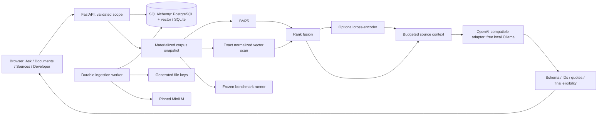

# Architecture and invariants

`config.py` owns typed limits and model revisions. `Models` owns a process's encoder, lazy reranker, model-load lock, inference semaphore, and measured RSS. FastAPI's synchronous search/generation routes run in its thread pool; model initialization and upload repository work are explicitly moved off the async event loop. Two Torch CPU threads and one inference slot are defaults. Separate API and worker processes each load their own necessary model, so process memory must be added when sizing a deployment.

PostgreSQL/pgvector is canonical persistent storage. The vector column really stores 384-dimensional vectors; the PostgreSQL integration test compares pgvector cosine distance with the application score. Both backends materialize the same permitted corpus and perform a small exact NumPy scan. This is deliberate: no approximate index or PostgreSQL full-text rank is misrepresented as BM25. This approach transfers the whole filtered corpus into process memory, so it is appropriate for the small portfolio corpus, not an unbounded enterprise corpus.

SQLite is an explicitly supported local/CI backend. Writers use `BEGIN IMMEDIATE`, foreign keys and WAL are enabled, and explicit read transactions avoid SQLite's legacy non-repeatable implicit reads. PostgreSQL scope writes lock the workspace row; materialized snapshot reads acquire a shared lock. The read transaction captures the active-version manifest and all required chunk text/vectors, then closes. BM25, dense, fusion, reranking, and generation use these copied objects, so no late query can mix versions. A final eligibility check precedes trace persistence and response publication. The provider call never holds a database transaction.

Documents hold logical identity and immutable interpretation metadata. Versions hold sequence, label, effective date, file/extraction hashes, pipeline fingerprint, model provenance, extracted text, states and warnings. The active pointer is updated only during a short fenced promotion transaction. Metadata edits are intentionally unsupported; create a replacement version to change the source locator or effective date. Old ready versions remain immutable history. Ordinary search never includes history; an admin can explicitly inspect a historical chunk.

Version transitions: `pending -> processing -> ready|failed`; explicit retries move `failed -> pending` while attempts remain. Deletion moves every version to `deleted`, clears text/vectors/files and active pointers, and fences its jobs. Ready version content is never edited. A newer upload sequence prevents an older job from replacing its active pointer. The previous active version survives a failed replacement. If two initial uploads race, an older successful build may remain history while the newest is pending; there is no implicit fallback publication of obsolete work.

Jobs use persisted `queued/running/completed/failed` states, attempt counts, expiring leases and random ownership tokens. Claims are serialized by scope and rechecked under a row lock in PostgreSQL. SQLite serializes writers. Every progress update and promotion checks the lease token and expiry. A crashed worker's job can be reclaimed; the obsolete worker cannot publish. Expensive extraction, chunking and embedding happen before chunks are written. All chunks, version readiness and promotion are committed together, so there is no publicly visible staging index to clean up. Abandoned raw-file writes before upload commit can be cleaned with `uv run python scripts/storage_gc.py` after a grace period.

The BM25 cache holds at most four fully built indexes. Keys include authorized scope, active manifest/revision, tokenizer version and parameters. Publication swaps a complete index under a lock. An API deletion clears its process cache; other processes cannot reuse the old manifest key. Captured snapshots are still checked for final eligibility. Query scores have names (`bm25`, `cosine_similarity`, `rrf`, `cross_encoder_score`) and are never probability estimates.

Context follows retrieval rank, caps each document at two passages, removes overlap greater than 65% of the shorter span, and accepts complete chunks only. It counts the serialized instructions/schema/question/evidence using `cl100k_base`, with answer and message-wrapper reserves. This tokenizer estimate is not exact for Qwen or every compatible provider; configure a larger provider context window and compare returned usage. Traces record selected and excluded IDs and reasons. An overlong query or query/passage pair fails clearly instead of silently truncating.

The provider receives no tools and no credentials in its context. It emits typed claims, evidence IDs, optional exact quotes and missing information. At most one repair call follows validation failure. The application constructs citations from supplied evidence; validates IDs, per-claim association, and whitespace-only quote normalization; and returns distinct statuses for missing evidence, conflict, provider failure and invalid output. Semantic support is assessed separately. The initial 3B model failures and omitted conditions from 7B demonstrate why this distinction matters.

Detailed traces expire after seven days and are admin-only. They include selected context IDs, results, usage and timings, and may include answer/citation excerpts. Deleting any version removes all traces whose corpus snapshot included it, conservatively even if it was not ultimately cited. Client responses already received cannot be revoked. An in-flight response may finish if deletion happens after its final eligibility/persistence transaction; this is the documented linearization point. New requests and evidence/history access cannot retrieve deleted content.
